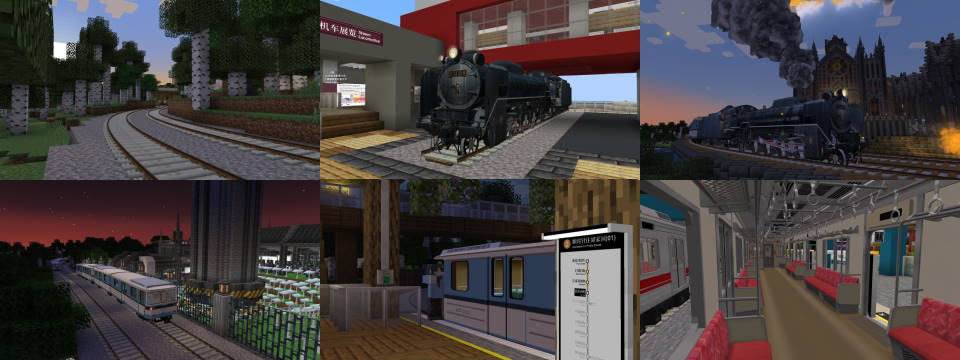

# NTE: Nemo's Transit Expansion

本模组 NTE（Nemo's Transit Expansion, 蓝星社交通扩展）包含一些由 [Zbx1425](https://www.zbx1425.cn) 制作的对 [MTR](https://www.curseforge.com/minecraft/mc-mods/minecraft-transit-railway) 模组本体的实验性扩展功能。作为 MTR 开发贡献者之一，作者希望对这些新颖的功能作为独立扩展模组先行发布、展示与实验，并将稳定的部分稍后合并入 MTR 本体中。

 本模组最初在 [Teacon 2022 模组开发茶会](https://www.teacon.cn) 上公开，当时名为蒸汽动力 (MTRSteamLoco)。

<iframe src="//player.bilibili.com/player.html?aid=818254400&bvid=BV1kG4y1G7yx&cid=910363279&page=1" scrolling="no" border="0" frameborder="no" framespacing="0" allowfullscreen="true"> </iframe>

  
  
  
## 物品使用方法与资源包制作说明

请在左侧侧边栏内查看。
  
  
  
## 下载

请参见 [下载](download.md)。

在服务器上使用 NTE 自带的或以资源包导入的含 OBJ 模型的列车时，其他没有安装 NTE 和对应资源包的玩家将不能看到这列车。
