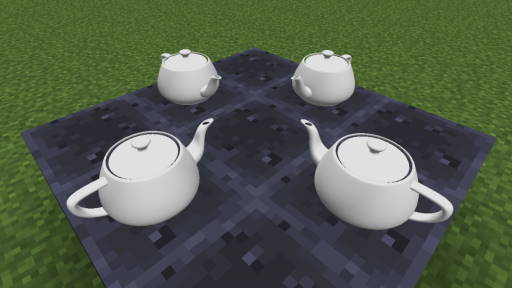

# 装饰物件

NTE 允许通过 ”装饰物件“ 方块在游戏内显示 OBJ 模型。



## 使用

您可在创造模式物品栏 ”车站建筑方块” 一栏中获得装饰物件方块。放置后，使用刷子右键它即可设定它所展示的模型。内置了一个 ”茶壶“ 模型供您试用，更多物件模型可通过资源包导入。

此方块不可见。当您手持刷子时，方块所在位置会显示旋转的刷子图标，以便您寻找。如果您的资源包内缺少某模型，它将显示为旋转的屏障方块图标（红色带斜线的 0 字）。

按住 Ctrl 的同时按鼠标中键，即可复制一个保持选定的模型的物品，以便放置多个。不过，考虑到性能影响，不建议您使用得太多。

顺带一提，这个茶壶是在 1975 年由计算机图形学者马丁·纽维尔 (Martin Newell) 于犹他大学 (University of Utah) 工作期间创作的，因此得名 “Utah 茶壶”。


## 制作新物件

您可以通过在 `assets/mtrsteamloco/eyecandies` 文件夹内添加 JSON 文件来导入模型制作物件。其写法大致如下：

```json
{
    "name": "茶壶",
    "model": "mtrsteamloco:eyecandies/teapot.obj"
}
```

在上述例子里，`assets/mtrsteamloco/eyecandies/teapot.json` 文件里有着以上内容，同时 `assets/mtrsteamloco/eyecandies/teapot.obj` 文件是茶壶的 OBJ 模型。

如上是一个 JSON 文件说明一个物件的写法。也可以在一个 JSON 文件内说明多个物件。

```json
{
    "key1": {
        "name": "Name1",
        "model": "mtrsteamloco:eyecandies/model1.obj"
    },
    "key2": {
        "name": "Name2",
        "model": "mtrsteamloco:eyecandies/model2.obj",
        "textureId": "mtrsteamloco:textures/eyecandies/foobar.png",
        "flipV": true,
        "translation": [ 0, 0, 0 ],
        "rotation": [ 0, 0, 0 ],
        "scale": [ 1, 1, 1 ],
        "mirror": [ false, false, false ]
    },
    "key3": {
        "name": "Name3",
        "scriptFiles": ["mtrsteamloco:eyecandies/script.js"]
    }
}
```

其中：

- 在一个 JSON 文件内说明多个物件的写法中，`key1`、`key2` 等是内部记录这个模型时所使用的名称，可任意选取，不会显示给玩家，但每个必须不同。在一个 JSON 文件说明一个模型的写法中，会把 JSON 文件的文件名用作这一用途。

### 使用模型
如`key1`、`key2`：

- `name` 是这个模型显示在选择列表里的名称。

- `model` 是这个模型所使用的 OBJ 文件的位置。

  需要按照 Minecraft 的 “资源位置” 写法转写，即 `assets/mtrsteamloco/eyecandies/teapot.obj` 需写为 `mtrsteamloco:eyecandies/teapot.obj`。

  设定贴图、渲染批次等的方法与 [OBJ 模型相关适配](objschem.md) 中相同。
  
  您使用的 OBJ 文件应当符合：相对于您放置物件时的朝向，X 轴正方向向右，Y 轴正方向向上，Z 轴正方向向后。每个单位长度为 1m。

以上是必填项。以下是可选项：

- `textureId` 可用于创建多个同一模型不同贴图的物件。用法与 OBJ 列车模型中相同。
- `flipV` (V大写) 设为 true 将把 OBJ 模型加载改为适配贴图 V 坐标正方向向上的导出方式的模式。
- `translation` 对模型进行平移，后接 X、Y、Z 轴向上的移动距离。
- `rotation` 对模型进行旋转，后接绕 X、Y、Z 轴向上的转动角度。
- `scale` 对模型进行缩放，后接 X、Y、Z 轴向上的缩放比例，1 代表 100%。
- `mirror` 对模型进行翻转，后接三个布尔值，表示是否要对于 YZ、XZ、XY 平面翻转。

请注意大括号、中括号、双引号与逗号的使用。同时，所有文件名必须为全英文小写。

### 使用脚本
如`key3`：

- `name` 是这个模型显示在选择列表里的名称。

- `scriptFiles` 是这个模型所使用的脚本文件的位置。注意与 `model` 一同出现时不起作用。详见 [装饰物件相关](js-eyecand.md)。
  
