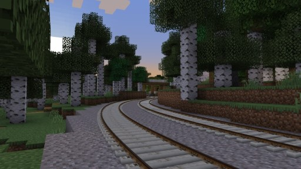
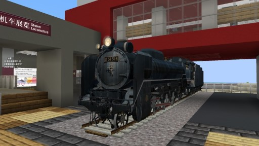
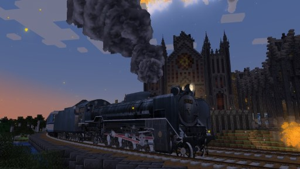
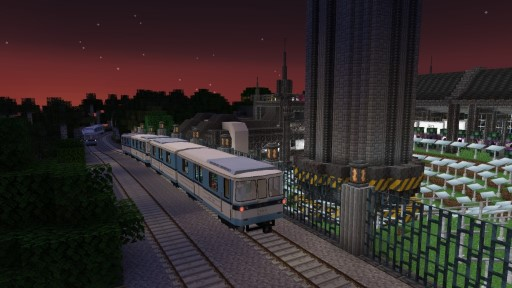
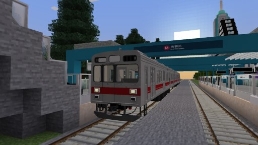
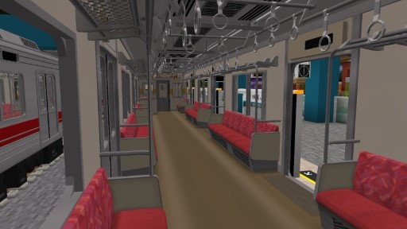

# 新增内容与功能

## 立体轨道

我们通过新技术，为 MTR 的轨道添加了立体模型。新制的渲染系统使它外观精致的同时几乎不造成卡顿。

外观为混凝土枕木上略有锈蚀的钢轨，轨距 1435mm。由于选择机制需更进一步适配，暂不考虑添加更多内置轨道模型或添加为不同轨道选用不同模型的功能。如需替换模型，请在材质包中替换 `assets/mtrsteamloco/models/rail.obj` 文件，OBJ 导入方面指引详见 [OBJ 模型相关适配](objschem.md) 。

作者：

- 贴图：Tucson Zeng

  http://www.tucson-blog.cn ；经授权修改使用

- 模型、编程：Zbx1425

立体轨道所使用的渲染技术目前和光影不兼容，打开光影时 NTE 将自动换回 MTR 原版的平面轨道效果。

## 新增列车

### 日本国铁 D51 型蒸汽机车

我们又通过新技术，为本车型的车轮及连杆系统制作了动画。车轮将随列车速度转动，连杆亦会随之往复，更添加了烟雾效果，让您体验到目前在 MTR 模组中独一无二的真实感与机械之美。

本车型的单车辆长度为 19m。

此外，NTE 还会自动添加 D51 机车牵引所有其他单车辆长度为 19m 之车型（包括 C-Train、K-Train、S-Train 等的小型版）的编组形式，以及 D51 机车牵引至多两节 DK3 的编组形式，以便您利用蒸汽机车开展载客业务。

作者：

- 模型、动画、声音：寝台急行銀河81号 (ginga81) 

  http://midnightexpginga81.web.fc2.com ；BVE 版本 © ginga81，GPLv2

  由 Zbx1425 移植到 MTR，并进行了少量修改

- 烟雾效果、编程：Zbx1425

### 北京地铁 DK3 型电动车组

我们又又通过新技术，为本车型添加了乘务组员的模型与动画。您可在列车到站与发车之间，看到列尾车长与驾驶员进行开关司机室门、操作车门、按动发车铃、及手指口呼安全确认等真实的运营操作程序。

本车型现实尺寸版的单车辆长度为 20m，迷你尺寸版的单车辆长度为 9m。

作者：

- 模型：南铁模 (CSSSC)

  http://www.csssc.com.cn ；BVE 版本 © CSSSC，保留所有权利

  由 Zbx1425 移植到 MTR，并进行了修改；移植后版本内容经授权再发布

- 动画、声音、编程：Zbx1425

要让乘务员操作动画播放完全，列车在每站应至少停靠 20 秒。

## OBJ 模型导入支持

> 注：此处的 东急 9000 系 列车模型系从 RTM 追加包中移植，仅在 NTE 开发期间用于个人测试相关功能的用途，**并不包括在 NTE 模组中**。此处图片亦只作为对 OBJ 模型导入功能的实例演示。该模型原作者为 西湘車輛，NTE 并未请求和/或得到使用授权，也并不会公开转换后的资源包。

还是通过新技术，NTE 为在 MTR 中使用 OBJ 格式的模型提供了支持。受益于新制的渲染系统，渲染性能更高，使用面数很高的精细模型时也不会造成很多卡顿。

详见 [OBJ 模型相关适配](objschem.md) 。

渲染优化目前与光影不兼容，打开光影时 NTE 将自动关闭渲染优化，使用原版渲染方式，届时卡顿将增加。

## 装饰物件

NTE 允许通过 ”装饰物件“ 方块在游戏内显示 OBJ 模型。详见 [装饰物件](eyecandy.md)

## 游戏内功能

NTE 添加了一些命令来控制一些功能的开关或查看一些参数：

- `/mtrnte config`

  打开 NTE 选项菜单，其中包含了一些开关如：是否不显示乘坐的列车、是否显示立体轨道、是否显示调试信息等。
  
  同时 `Mod Menu` 也可以打开 NTE 选项菜单。

- `/mtrnte start`

  在聊天栏打印帧次渲染的信息如：面数，DrawCall 数量，上传到的模型等。

- `/mtrnte hideriding`

  隐藏正在搭乘的列车。